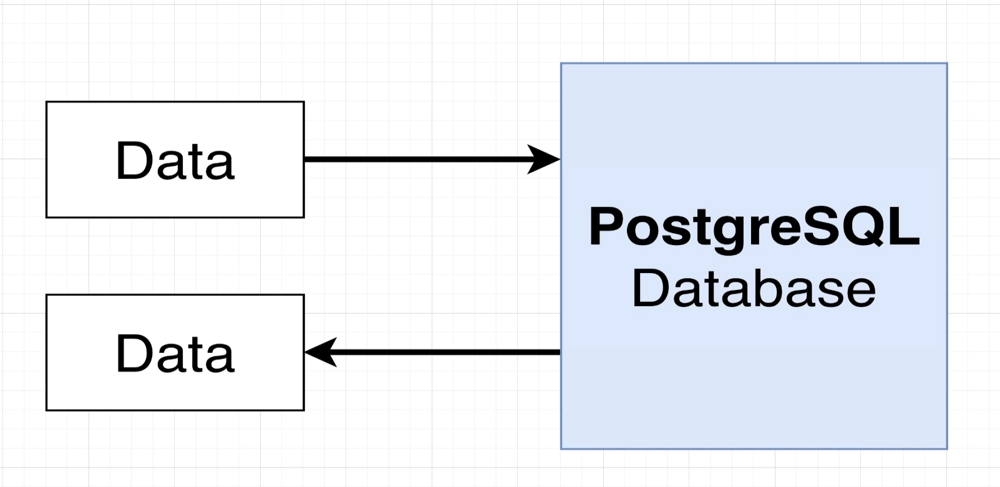
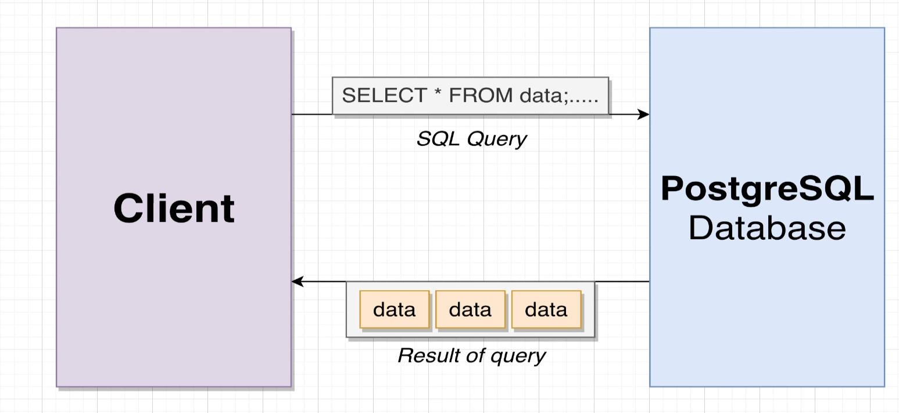
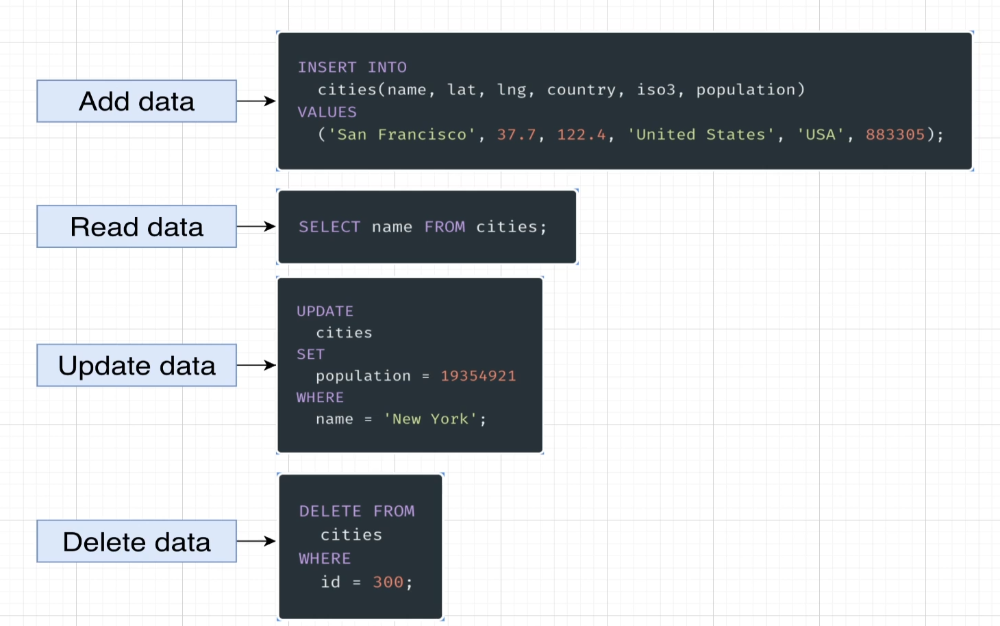
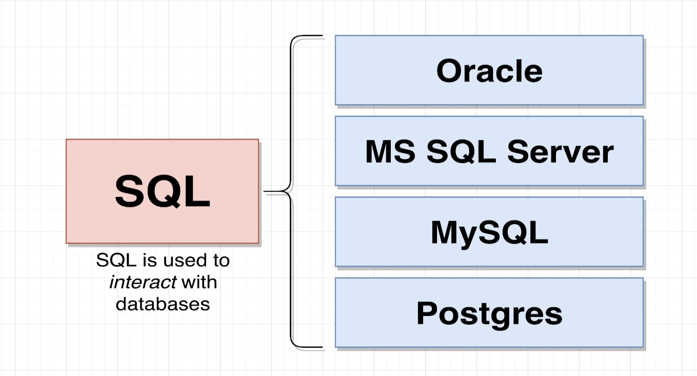
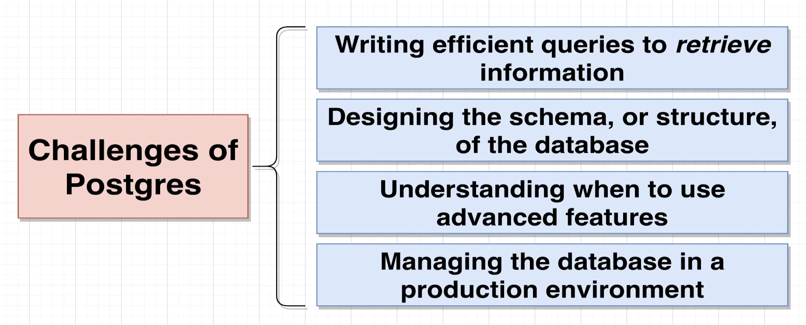

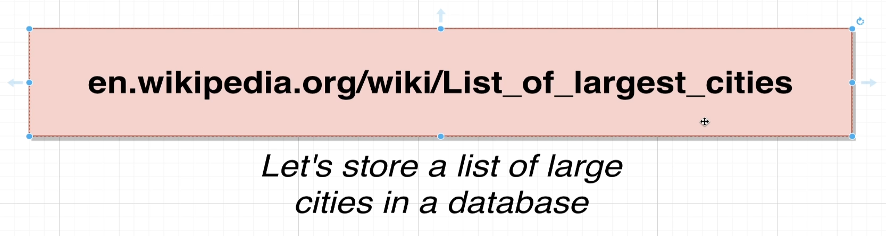
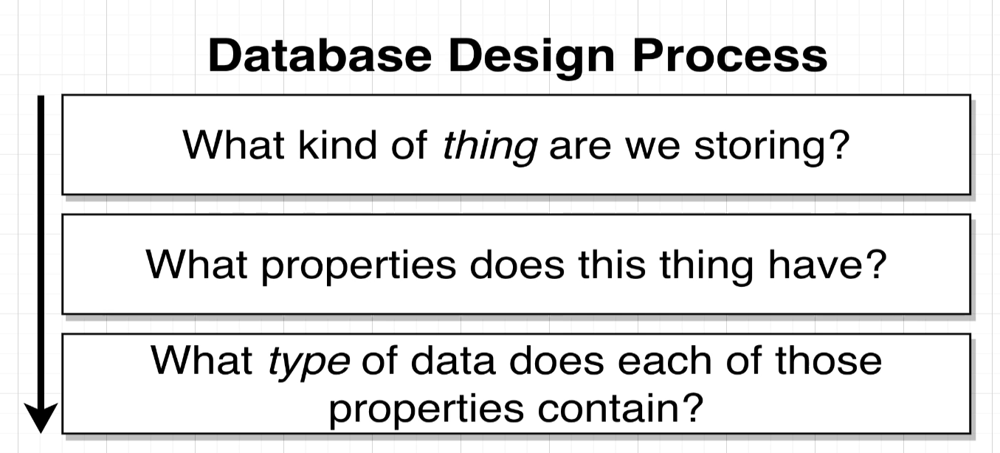
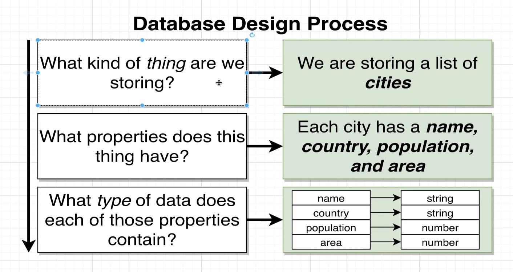

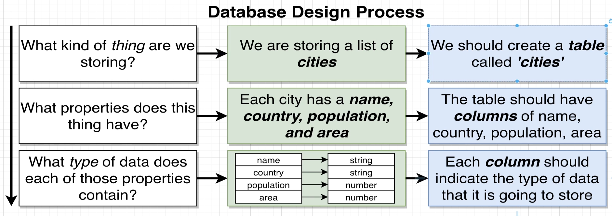
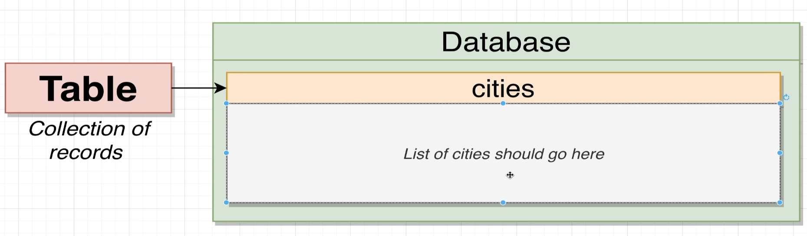
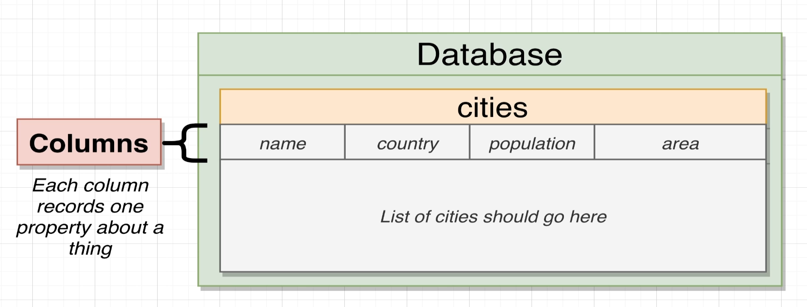
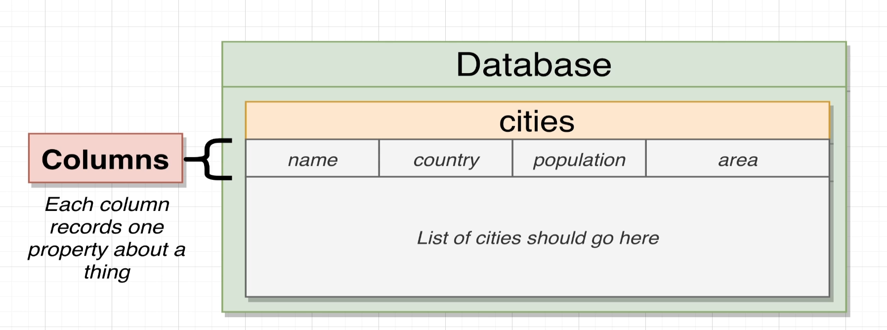

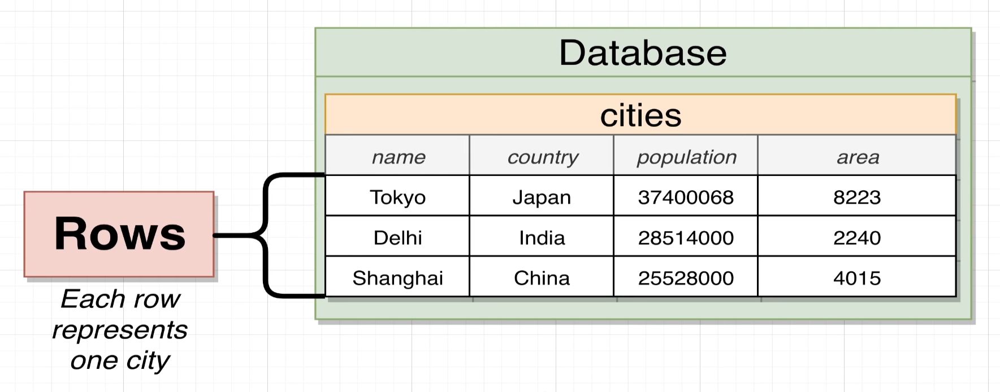


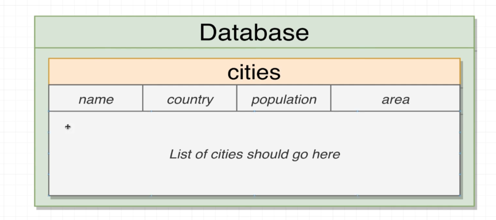

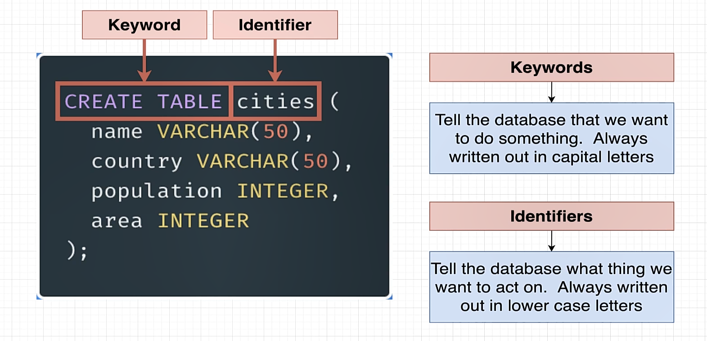

to create the database and table run the following sql commands in the terminal

```sql
-- should be only run once to create the database and table
DROP DATABASE IF EXISTS cities;
CREATE DATABASE cities;

DROP TABLE IF EXISTS cities;

CREATE TABLE cities (
    name VARCHAR(50),
    country VARCHAR(50),
    population INTEGER,
    area INTEGER
);
```


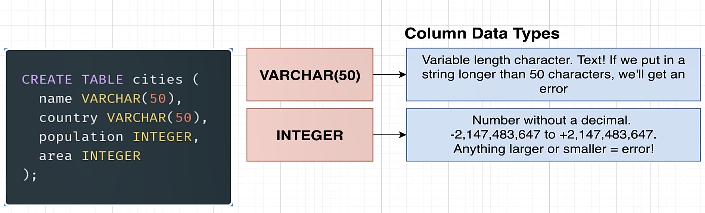

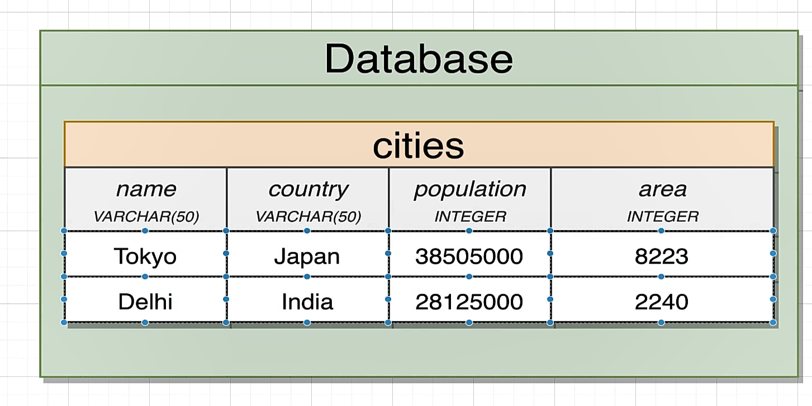

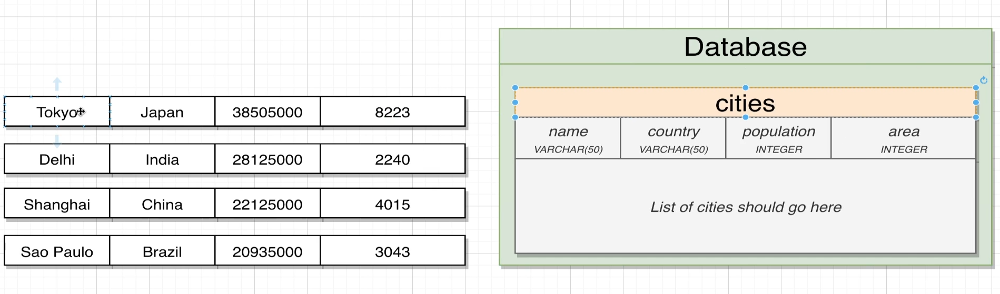

```sql
-- let's add tokyo,Delhi,Shanghai,Sao Paulo
INSERT INTO cities (name, country, population, area) VALUES ('Tokyo', 'Japan', 37400068, 2188);
INSERT INTO cities (name, country, population, area) VALUES ('Delhi', 'India', 28514000, 573);
INSERT INTO cities (name, country, population, area) VALUES ('Shanghai', 'China', 25582000, 6340);
INSERT INTO cities (name, country, population, area) VALUES ('Sao Paulo', 'Brazil', 21650000, 1521);
```

| name | country | population | area |
| :--- | :--- | :--- | :--- |
| Tokyo | Japan | 37400068 | 2188 |
| Delhi | India | 28514000 | 573 |
| Shanghai | China | 25582000 | 6340 |
| Sao Paulo | Brazil | 21650000 | 1521 |
