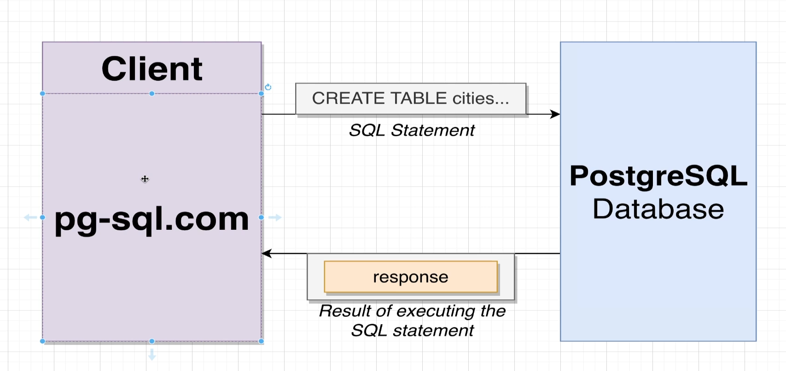
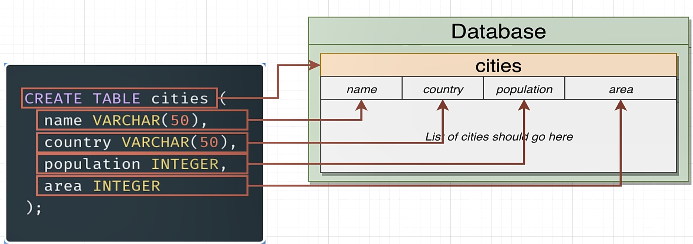

to create the database and table run the following sql commands in the terminal

```sql
-- should be only run once to create the database and table
DROP DATABASE IF EXISTS cities;
CREATE DATABASE cities;

DROP TABLE IF EXISTS cities;

CREATE TABLE cities (
    name VARCHAR(50),
    country VARCHAR(50),
    population INTEGER,
    area INTEGER
);
```




```sql
-- let's add tokyo,Delhi,Shanghai,Sao Paulo
INSERT INTO cities (name, country, population, area) VALUES ('Tokyo', 'Japan', 37400068, 2188);
INSERT INTO cities (name, country, population, area) VALUES ('Delhi', 'India', 28514000, 573);
INSERT INTO cities (name, country, population, area) VALUES ('Shanghai', 'China', 25582000, 6340);
INSERT INTO cities (name, country, population, area) VALUES ('Sao Paulo', 'Brazil', 21650000, 1521);
```

| name | country | population | area |
| :--- | :--- | :--- | :--- |
| Tokyo | Japan | 37400068 | 2188 |
| Delhi | India | 28514000 | 573 |
| Shanghai | China | 25582000 | 6340 |
| Sao Paulo | Brazil | 21650000 | 1521 |


```sql
SELECT C.name, C.population / C.area AS population_density
FROM cities c;
```


| name | population\_density |
| :--- | :--- |
| Tokyo | 17093 |
| Delhi | 49762 |
| Shanghai | 4035 |
| Sao Paulo | 14234 |


```sql
-- EXERCISE 2

DROP TABLE IF EXISTS phones;

CREATE TABLE phones
(
    name         TEXT,
    manufacturer TEXT,
    price        INTEGER,
    units_sold   INTEGER
);

INSERT INTO phones (name, manufacturer, price, units_sold)
VALUES ('Galaxy S8', 'Samsung', 720, 5000),
       ('iPhone 7', 'Apple', 770, 10000),
       ('Xperia XZ', 'Sony', 550, 3000),
       ('U Ultra', 'HTC', 750, 1000),
       ('G6', 'LG', 650, 2000);

SELECT p.name, p.units_sold * p.price AS revenue
FROM phones p;

```

| name | revenue |
| :--- | :--- |
| Galaxy S8 | 3600000 |
| iPhone 7 | 7700000 |
| Xperia XZ | 1650000 |
| U Ultra | 750000 |
| G6 | 1300000 |


```sql
SELECT c.name || ', ' || c.country
FROM cities c;
```

| ?column? |
| :--- |
| Tokyo, Japan |
| Delhi, India |
| Shanghai, China |
| Sao Paulo, Brazil |

we can also use the concat function to achieve the same result

```sql
SELECT concat(c.name, ', ', c.country) as location
FROM cities c;
```

we can use lower and upper functions to convert the string to lower and upper case

```sql
SELECT concat(upper(c.name), ', ', lower(c.country)) as location
FROM cities c;
```

| location |
| :--- |
| TOKYO, japan |
| DELHI, india |
| SHANGHAI, china |
| SAO PAULO, brazil |
